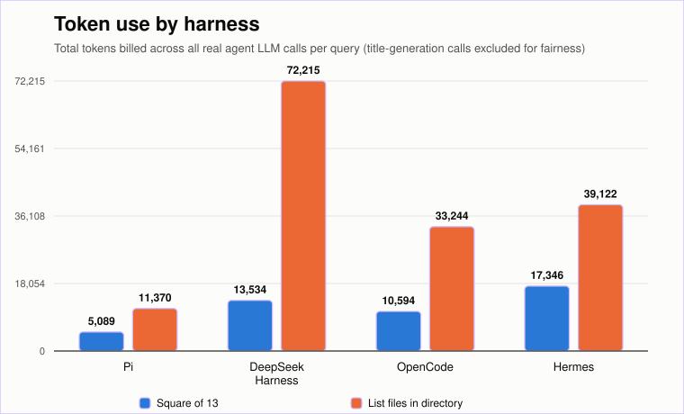
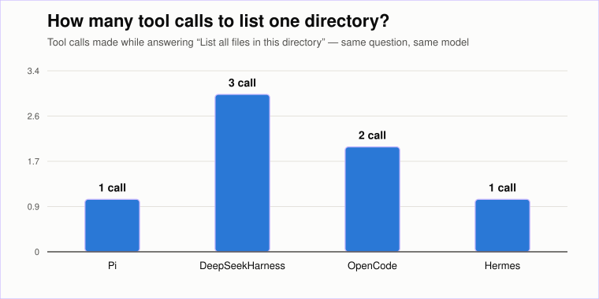

# What Is a Harness? Why an LLM Alone Can't Be a Coding Agent

You type a prompt into an AI coding assistant. A few seconds later, an answer appears. Maybe it read a file first. Maybe it ran a command. Then it's just... there — text, in your terminal, as if it arrived by magic.

It didn't. The thing doing the magic has a name almost nobody outside the field uses correctly, if they use it at all: a **harness**. This post is about that word — what it actually means, why an LLM is genuinely useless without one, why a harness alone still isn't enough, and then — because we don't like making claims we haven't checked — a full trace of four *real* open-source harnesses (pi, DeepSeek Harness, OpenCode, Hermes) pointed at the *same* model, asked the *same* two questions, with every byte of what actually got sent and returned read and verified.

> **Who this is for**: the next few sections assume nothing — if "harness" is a new word to you, start there. If you already know what a harness is and want the receipts — real trace data across four implementations — jump to [The experiment](#the-experiment).

---

## What is a "harness," actually?

Think of the large language model — GPT, Claude, DeepSeek, Nemotron, whatever — as an engine. It's extremely good at exactly one thing: given some text, predict what text should come next. That's it. That's the whole capability. An engine, on its own, can't drive anywhere — it needs a car built around it: a steering wheel, a dashboard, wheels that actually touch the road.

A **harness** is that car. It's the software layer that:

1. Takes your plain-English request and wraps it with instructions the model needs but you never typed (who it is, what tools it has, what directory it's working in)
2. Gives the model a defined set of **tools** — read a file, run a shell command, edit code — that it can ask to use
3. Runs a **loop**: send the request, see if the model wants to use a tool, actually run that tool for real, feed the result back, and repeat until the model has a final answer
4. Hands you back plain text

!!! note "In plain terms"
    The model can only ever do one thing: guess the next word. It cannot, by itself, open a file on your laptop, run a command, or know today's date. A harness is the piece of software standing between the model and your actual computer, translating "I'd like to run `ls`" into a real command that really runs, then translating the real result back into words the model can read.

## Why "harness" is such a confusing word

Ask five people in this space to define "harness" and you'll likely get five different answers, because the word gets used loosely for several distinct things at once:

- Sometimes it means the **whole CLI tool** you install and run (Claude Code, pi, Hermes)
- Sometimes it means specifically the **loop** — the send/check-for-tool-call/execute/repeat mechanism described above — as distinct from the UI wrapped around it
- Sometimes people say "agent" or "framework" or "scaffold" or "runtime" instead, meaning roughly the same thing
- And two of the four tools traced in this post — pi and OpenCode — never use the word "harness" to describe themselves at all; **DeepSeek Harness** even put the word in its own name

For this post, "harness" means the whole software layer between the raw model API and a working coding tool — the numbered list above, end to end. If you see another term used elsewhere for roughly the same idea, that's not a contradiction; the ecosystem genuinely hasn't converged on one word yet.

## What happens with no harness at all

This is the part worth actually seeing, not just being told. Take the exact same question we ask every harness later in this post — *"list all files in this directory"* — and send it to a raw model API with **no tools attached at all**. No `bash`, no `read`, nothing:

```json
{
  "model": "some-llm",
  "messages": [
    {"role": "user", "content": "List all files in this directory."}
  ]
}
```

!!! danger "What actually happens"
    One of two things, and both are bad. Either the model correctly says *"I don't have access to your filesystem"* — a dead end, no matter how good the model is — or, worse, a confident model **invents a plausible-looking file listing anyway**, because next-token prediction has no built-in concept of "I actually know this" versus "this sounds like the kind of thing that goes here." It isn't lying on purpose. It's doing exactly what it was built to do — predict likely-sounding text — applied to a question that plain text prediction can never actually answer.

That second failure mode is the one that should worry you more. A refusal is at least honest. A **confidently wrong, fabricated directory listing** looks identical to a correct one until you check it against reality — and checking against reality is precisely the one thing a harness exists to do that a raw model call cannot.

## Why this matters

A harness's entire reason for existing is to convert "plausible-sounding text" into "verified, real actions with real results fed back into the conversation." Every tool call in this post — `bash ls -la`, `glob("*")`, `read()` on a directory — is the harness taking the model's *request* to do something and actually doing it for real, then handing the *real* result back. Without that loop, you don't have an agent. You have autocomplete with extra steps, guessing what a file listing probably looks like instead of reading one.

## A harness doesn't fix a weak model

Here's the part that surprises people once they understand the first half of this: **giving a weak or older model a harness does not automatically make it a good agent.** A harness supplies the *capability* to call tools — it doesn't supply the *judgment* to call the right one, with the right arguments, and to reason correctly about what comes back. Those are still entirely the model's job.

!!! warning "This isn't theoretical — we caught it live"
    Later in this post, the exact same model, given the exact same question, called a wrong tool with no arguments and confidently reported the contents of the wrong directory — not because the harness was broken, but because the model incorrectly inferred where it was from an unrelated line of context and never double-checked. A different harness's tool made a *different* model call it recursively across an entire 130-package repository, returning 70,907 results for a question that needed maybe thirty. Same underlying capability (a harness, tools, a loop) — two very different failure modes, both caused by the model's own reasoning, not the plumbing around it.

A harness is necessary. It is not sufficient. That distinction — capability versus judgment — is the thread running through everything that follows.


Every one of the four harnesses traced below — despite being built in different languages, by different teams, with completely different philosophies — implements exactly this loop underneath. That convergence, on its own, is one of the more interesting findings here.

## The experiment

We used one model throughout — **Nemotron 3.5 Lightning**, via a single custom NVIDIA endpoint — so every difference we found is attributable to the *harness*, not to the model getting smarter or dumber between tests. And we asked each harness exactly two questions:

- **"What is the square of 13?"** — a question the model can answer purely from its own reasoning. No file access, no command execution needed. This is our baseline: what does it cost to do *nothing* but think?
- **"List all files in this directory."** — a question the model *cannot* answer without using a tool. It has to decide which tool, call it, read the result, and decide whether that's enough. This is where harness design choices actually start to matter.

We instrumented each harness at the source level — adding trace logging where necessary, reading built-in session logs where they already existed — to capture the literal request sent to the model and the literal response that came back, not a summary of either.

---

## Meet the four

| | Pi | DeepSeek Harness | OpenCode | Hermes |
|---|---|---|---|---|
| Built by | earendil-works | DeepSeek AI | SST / opencode.ai | Nous Research |
| Language / runtime | TypeScript (Node, via `tsx`) | TypeScript (Node, via `tsx`-ESM) | TypeScript (Bun) | **Python** (`uv`) |
| Core design philosophy | A focused core with an extension system on top | "Everything is a plugin" (Cordis framework) | Client/server split — one backend, multiple frontends (TUI, web, desktop) | Self-improving agent — memory, skill creation, cross-session learning |

Three of the four are JavaScript/TypeScript, one flavor or another. Hermes is the outlier — a Python stack managed by `uv`, and the only one of the four explicitly designed around persistent, evolving memory rather than a fresh start each session.

---

## Deep dive 1: Pi — the minimal baseline

Pi ships with exactly **4 default tools**: `read`, `write`, `edit`, `bash`. Its system prompt is a single, flat string — **16,396 characters** — built fresh each session from tool descriptions, project instructions (`AGENTS.md`), and the current working directory, all folded into one block of text.

Nothing about pi's request/response cycle is visible by default. We had to add trace instrumentation to **6 separate source files** — the agent loop, the system-prompt builder, the tool implementations, and the actual HTTP request layer — before we could see the literal system prompt, the full tool schemas, and the model's raw internal reasoning text. Once instrumented, though, the picture was completely clean:

- **Math question**: one LLM call, **5,089 total tokens**, no tool use. Done.
- **File-listing question**: the model reasoned *"I'll use the bash command to do this"* and called `bash({command: "ls -la"})` — exactly one tool call, non-recursive, top-level only. A second LLM call read the result and wrote the final answer. **11,370 total tokens** across both calls.

> Pi never fires a hidden LLM call just to generate a conversation title. Every other harness in this post did, at least once — see below.

## Deep dive 2: DeepSeek Harness — everything is a plugin

DeepSeek Harness (`dsh`) takes the opposite architectural bet from pi: instead of a fixed core, **every capability — the agent loop, the LLM provider, session storage, even the tool registry — is a swappable plugin**, composed at boot time from a YAML file. It's built on a framework called Cordis, whose explicit design goal is letting capabilities be added or removed *without restarting the process* — a deliberate contrast to how, say, VS Code's extension host requires a full restart to change what's loaded.

One genuinely surprising discovery: dsh's LLM adapter **literally depends on pi's own `pi-ai` npm package** as one of its backends. Two independently-developed harnesses, sharing the same underlying LLM-API compatibility layer — a small but real signal that the ecosystem is starting to converge on shared infrastructure rather than everyone reinventing it.

dsh's default tool catalog is **25 tools** — file, shell, subagent, workflow, goal-tracking, and job-management tools, reflecting "everything is a plugin" taken to its logical model-facing conclusion. Its system prompt is architecturally different from pi's too: instead of one big string, it's split across **four separate messages** — a 4,163-character `system` field, plus three more injected as distinct `user`-role messages tagged by source: `AGENTS.md` content (16,364 characters), a sandbox/approval-policy snapshot (486 characters), and a full skill catalog (5,292 characters). Total: **26,305 characters** of context before your actual question is even added — bigger than pi's single string, just packaged differently.

The best part of tracing dsh: **we needed zero manual instrumentation**. Its own contribution guidelines state a hard rule — *"Model-visible ⟺ logged: anything that reaches a model request must be reconstructable from the session log."* We tested that claim directly rather than trusting it, and it held completely. Every session is written as a zstd-compressed, append-only JSONL file, and it already contained the full system prompt, complete tool schemas, and the model's raw unfiltered reasoning text — no source edits required.

- **Math question**: **2 total LLM calls** — one hidden title-generation call, then the real answer. Real-call cost: **13,534 total tokens**.
- **File-listing question**: **4 total LLM calls** (1 title-gen + 3 real steps). The model's first move was `glob({pattern: "*"})` — and because the system prompt explicitly documents that a bare `*` pattern in `glob` matches *every file in the entire tree, not just the top level*, that single call returned **70,907 paths**, far too many to inline (they got automatically spilled to a temp file instead). The model then spent two more corrective calls narrowing down with plain `bash ls -la`. Total across the three real agent steps: **72,215 tokens** — by far the most expensive path to the same answer in this whole experiment.

## Deep dive 3: OpenCode — client/server, and a system prompt that reads like Claude Code's

OpenCode is architecturally the most distinct of the four: a real **client/server split**, with one backend server supporting several independent frontends (a terminal UI, a web app, a desktop app). The globally-installed CLI isn't even running the TypeScript source directly — it's a wrapper script that locates and launches a **precompiled native binary**. That matters in practice: editing OpenCode's source and running the global install shows *zero* effect. Tracing it required running from source via Bun instead.

Its default tool catalog is **11 tools**: `bash, edit, glob, grep, invalid, read, skill, task, todowrite, webfetch, write` (that `invalid` entry looks like a placeholder or bug, not a real capability — flagged, not chased down further). Its system prompt for the real agent call is a single string, **22,090 characters** — the largest single-message system prompt of the four (dsh's *total* context ends up bigger once its three extra injected messages are counted, but that's spread across four messages, not one) — and its exact phrasing is strikingly close to Claude Code's own: *"You should be concise, direct, and to the point... You MUST answer concisely with fewer than 4 lines... Never use tools like Bash or code comments as means to communicate with the user."* Worth noting plainly, not as an accusation — terminal-based coding agents plausibly converge on similar concision constraints independently, since the design pressure (small terminal windows, no room for narration) is the same for everyone.

OpenCode persists everything to a **SQLite database**, not files — a `message`/`part` table pair holding JSON blobs per turn. Checking directly, nearly everything was already there without instrumentation: raw reasoning text, full tool input/output, final answers, even a capability neither of the other harnesses has — **a git snapshot hash recorded after every single step**, meaning OpenCode can literally diff your entire workspace between any two tool calls. The one real gap: the system prompt itself was never persisted anywhere. One line of trace code at the exact point it's assembled closed that gap completely.

- **Math question**: **2 total LLM calls** (title-gen + real). Real-call cost: **10,594 total tokens**.
- **File-listing question**: **4 total LLM calls** (title-gen + 3 real steps), but only **2 tool calls** — both were the same `read` tool, because OpenCode's `read` is **polymorphic**: point it at a file, get file contents; point it at a directory, get a directory listing. That single design choice sidestepped dsh's exact failure mode — no separate `glob`/`ls` split meant no risk of an accidentally-recursive oversized result. Total across the three real steps: **33,244 tokens**.

## Deep dive 4: Hermes — the Python outlier, with a real bug we caught live

Hermes is built by Nous Research around a different core promise than the other three: a **self-improving agent** with persistent cross-session memory, autonomous skill creation, and a genuinely large bundled skill library (19 skills shipped by default, several with individual instruction files over 30KB). It's the only Python-based harness of the four, managed with `uv`.

Its actual runtime system prompt, verified directly from an exported session, is **17,154 characters** — reasonably close to pi's. A separate built-in diagnostic command, `hermes prompt-size --json`, reports something much larger — up to **115,646 characters** — but that figure is a *budget ceiling*: it sums the full Markdown body of every bundled skill file, not what's actually sent. In practice, only a lightweight *index* of skill names and one-line descriptions goes into the real prompt; full skill content loads on demand. Worth stating precisely, because the two numbers look contradictory if you don't know which one describes the theoretical maximum versus the actual wire payload.

Hermes also has the best built-in tracing story of any of the four for content — `hermes sessions export <id> --format jsonl` dumps the complete session (full system prompt, raw reasoning, every tool call and result) with zero manual instrumentation needed, similar to dsh.

- **Math question**: **1 LLM call**, no hidden title-generation call this run — **17,346 total tokens**.
- **File-listing question**: **2 LLM calls**, and this run *did* get a hidden title-gen call (`title_source: "llm"`) — an inconsistency between the two runs we haven't resolved, flagged rather than papered over. **1 tool call**, `terminal({"command": "ls -la"})`.

> **We caught a real, reproducible bug here.** The file-listing answer described the contents of the user's *home directory*, not the actual invocation directory. Tracing the model's own reasoning text found the exact cause: *"Let me check the current working directory first — it's /Users/sarathn based on the context."* Searching the full system prompt for that path found exactly one occurrence — an unrelated line about where Hermes stores its own profile data. Unlike pi, dsh, and OpenCode, **Hermes never injects an explicit "current working directory" fact into the system prompt**. The model guessed from an adjacent, unrelated fact, guessed wrong, then ran a path-less `ls -la` that landed wherever the shell process's default directory happened to be. Two symptoms, one root cause, both traced to source.

Real-call cost for the file-listing question: **39,122 tokens** across the two calls — for an answer that, worth repeating, was about the wrong directory.

---

## The numbers, side by side

### System prompts, side by side

Every harness injects the same *categories* of information — who the model is, what tools it has, project-specific instructions, environment facts — but packages them completely differently. This matters because packaging choices (one string vs. several messages, full skill bodies vs. an index) directly drive the token-cost differences in the next section:

| | Pi | DeepSeek Harness | OpenCode | Hermes |
|---|---|---|---|---|
| Total size | **16,396** chars | **26,305** chars | **22,090** chars | **17,154** chars |
| Delivered as | 1 message | 1 `system` message + 3 separate `user`-role injections | 1 message | 1 message |
| Persona / identity | ✅ | ✅ | ✅ (closely mirrors Claude Code's phrasing) | ✅ |
| Tool descriptions | ✅ (4 tools) | ✅ (25 tools) | ✅ (11 tools) | ✅ (~19 tools) |
| Project instructions (`AGENTS.md`) | Inlined into the same string | **Separate message**, tagged `source: agent-instructions` | Inlined into the same string | Inlined into the same string |
| Skills | Full skill content inlined | **Separate message**, full catalog | Not present in our trace | Index only (names + one-line descriptions) — full skill bodies load on demand |
| Current working directory | ✅, explicit line | ✅, but via a *different* injected message (the sandbox-policy one), not the `system` field itself | ✅, explicit line | ❌ — **never observed anywhere**, and this absence is the root cause of the Hermes bug below |

### Token cost, side by side



Same model, same two questions, and the most expensive path (DeepSeek Harness, file-listing) costs roughly **14x** more than the cheapest (Pi, math question) — almost entirely explained by default tool-catalog size and system-prompt packaging, not anything about the underlying model.

### Tool calls, side by side



Tool-call count is not simply "fewer is better" here — Hermes's single call produced a **wrong** answer, while Pi's single call was correct. The count alone doesn't tell you about correctness; you have to check what was actually called, with what arguments, and what came back:

| | Tool(s) called | Arguments | Outcome |
|---|---|---|---|
| Pi | 1× `bash` | `ls -la` | Correct — real repo contents |
| DeepSeek Harness | 1× `glob`, then 2× `bash` | `*` (recursive, all depths) → 70,907 paths, then 2 corrective `ls -la` | Correct, after 2 unnecessary corrections |
| OpenCode | 2× `read` | path = repo root, then path = `packages/` | Correct — `read` is directory-aware |
| Hermes | 1× `terminal` | `ls -la`, **no path argument at all** | **Wrong** — listed the user's home directory |

### Conversation shape (message counts)

"Total tokens" hides an important second dimension: how many separate messages actually built up in the model's context by the time each task finished. We counted every user/assistant/tool-result turn that ends up in the final request — pi, OpenCode, and Hermes all converge on the identical shape (2 messages for a no-tool answer, 4 for a one-tool-call answer) despite being three unrelated codebases. DeepSeek Harness's count is structurally higher for two independent reasons at once: its 3 extra injected context messages (see the system-prompt table above), *and* the 3 tool calls the file-listing task needed instead of 1:

| | Pi | DeepSeek Harness | OpenCode | Hermes |
|---|---|---|---|---|
| Messages — math question | **2** | **5** | **2** | **2** |
| Messages — file-listing question | **4** | **11** | **4** | **4** |

### Everything else, side by side

| | Pi | DeepSeek Harness | OpenCode | Hermes |
|---|---|---|---|---|
| Default tool count | **4** | **25** | **11** | **~19** |
| Hidden title-generation LLM call | No, in any run traced | **Yes, both runs traced** | **Yes, both runs traced** | Inconsistent (1 of 2 runs) |
| Session storage format | Not directly inspected in this pass | zstd-compressed JSONL | SQLite (message + part tables) | SQLite, exportable via CLI |
| Manual instrumentation needed to see everything | 6 source files | **0** — built-in log already complete | 1 call site (system prompt only) | **0** for content — full CLI export already complete |
| Notable extra capability | — | Automatic large-output "spill" to file | Per-step git workspace snapshot | Persistent skills, offline prompt-size budget tool |

---

## What surprised us

**Three of four harnesses spend an LLM call just to name your conversation.** dsh and OpenCode did this on both runs we traced for each; Hermes did it on one of two. Pi never did, in any run we traced. If you're being billed per token and per request, this is a real, if small, recurring cost that most users never see and most harnesses never disclose.

**A single tool-design choice (recursive `glob` vs. polymorphic `read`) was the difference between 2 tool calls and 3, and a 33K-token task versus a 72K-token one.** DeepSeek Harness's `glob` tool did exactly what its own documentation said it would — the failure wasn't a bug, it was a tool whose default behavior didn't match the task at hand, and the model had to spend two extra round-trips discovering that.

**"Installed" doesn't always mean "editable."** OpenCode's global install is a compiled binary; editing the source and running `opencode` from your `PATH` silently does nothing. If you're trying to instrument or extend one of these tools, always confirm you're actually running from source before you start debugging why your changes "aren't working."

**A harness's own diagnostic tools can mislead you if you don't know what they're measuring.** Hermes's `prompt-size` command reported a number nearly 7x larger than what was actually sent, because it measures a worst-case budget, not the real payload. Always cross-check a self-reported number against the literal wire data when you can.

**The one real bug we found (Hermes's missing cwd fact) is exactly the kind of thing that's invisible until you trace it.** The model didn't crash, didn't error, didn't even hedge — it confidently answered a question about the wrong directory, and the only way to know was to read its own reasoning text against the actual system prompt content, side by side.

---

## Takeaways

1. **Every agent harness, regardless of language or architecture, implements the same underlying loop**: LLM call → tool-call check → execute tool for real → feed result back → repeat until the model stops asking for tools. That convergence held across a monolith-with-extensions design, an all-plugin design, a client/server design, and a memory-first design.
2. **Observability is a design choice a team makes, not something you get for free.** dsh's contribution guidelines treat "everything the model sees must be logged" as a hard rule, and it showed — zero instrumentation needed. Pi required the most manual work of the four. That's a real, measurable difference in how much a team invested in making their own system debuggable.
3. **Default tool catalogs are a genuine cost lever**, not just a feature checklist. Going from 4 tools to 25 tools measurably inflates every single request, whether or not those extra tools ever get used in a given conversation.
4. **Correctness and efficiency are separate axes.** The harness that used the fewest tool calls (Hermes, tied with pi at 1) produced the wrong answer. Don't judge a harness by call count alone — check what actually happened.
5. **Tracing at the source level catches real bugs that black-box testing won't.** We didn't set out to find the Hermes cwd bug — it fell out of doing the same rigorous trace-and-verify pass we'd already done for the other three.

---

## What's next

This series started as a simple question — "what actually happens when I hit enter?" — and turned into a real, reproducible dataset across four structurally different open-source agent harnesses. If you build or evaluate coding agents, the honest takeaway is: don't trust a harness's documentation *or* its own diagnostic tools at face value — trace the wire payload, read the session log, and verify the number against the byte count yourself. Every finding in this post came from doing exactly that.

One open question from this pass is still unresolved: why did Hermes's title-generation call fire on one run and not the other? That's worth a follow-up on its own. If this kind of hands-on systems tracing is useful to you, follow along for what comes next.
