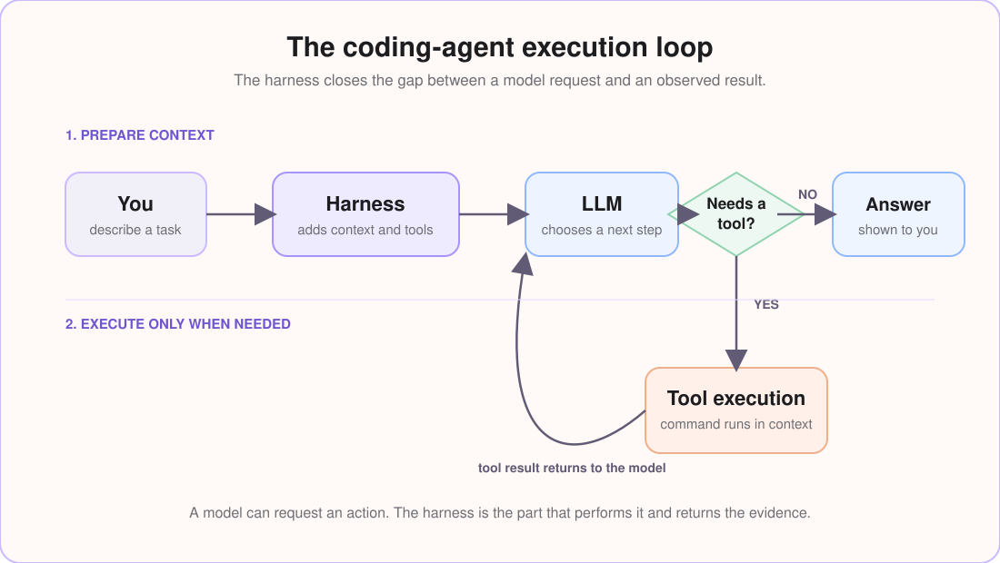
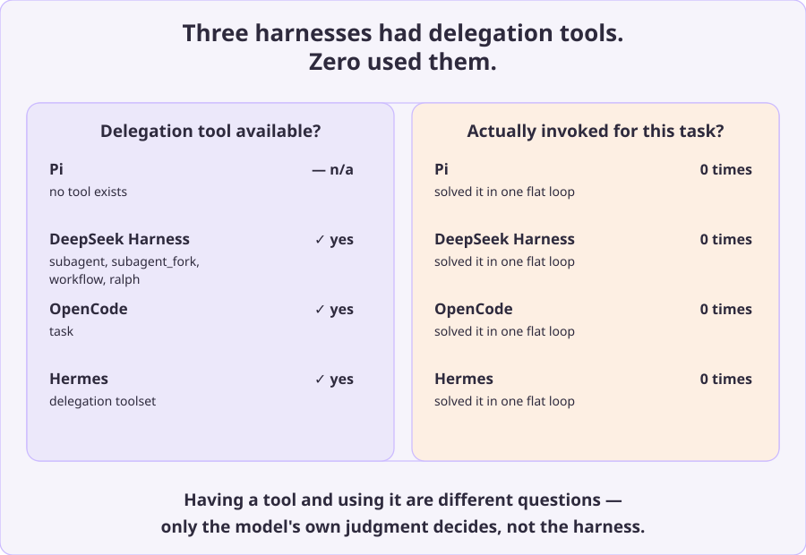

# Inside a Coding-Agent Harness: How an LLM Becomes an Agent

> Tools, execution, state, context, and the loop that turns model output into real work.

Ask a language model, “What is the square of 13?” It can answer from the context already available to it. Now ask, “List all files in this directory.” The wording is equally simple, but the second request needs something the model does not possess: access to a real directory.

To complete that request, another system must expose a filesystem tool, decide where the command runs, execute it, capture the result, and return that evidence to the model. That system is the **coding-agent harness**.

This investigation follows that layer across Pi, DeepSeek Harness, OpenCode, Hermes, and TrueForge. It is not a winner/loser benchmark. The aim is to show how choices around context, tools, execution, and product features shape the behavior of the same basic agent loop.

!!! note "Measurement scope"
    Pi, DeepSeek Harness, OpenCode, and Hermes were tested using the same endpoint and the same two prompts. TrueForge was examined in a separate local trace. Its timings illustrate its internal flow, but are not directly comparable with the controlled four-harness measurements.

## The model is not the agent

At its core, an LLM maps an input context to a sequence of output tokens. Those tokens may represent an answer or a structured request to use a tool, but the model does not execute that request.

The harness provides the missing operational layer. It assembles context, presents tools, runs approved actions, preserves state, and feeds tool results back into the next model call. A coding agent is therefore a loop around the model—not the model alone.

### The request-to-result loop

Given the supplied instructions and tools, the model may generate a tool request when it needs external evidence. The harness validates and executes that request, then adds the result to the conversation. The loop continues until the model produces a final answer or the runtime stops the turn.

The distinction is practical. Without execution and result return, “list the files in this directory” remains text generation. A model can suggest `ls -la`; it cannot know what that command returned until another system runs it and supplies the output.

## What the harness actually controls

The harness does more than attach tools to a model. It defines the environment in which the model is allowed to work.

| Responsibility | What it does | Why it matters |
|---|---|---|
| Context and prompt construction | Combines policy, task context, history, and tool schemas | Changes what the model sees and the cost of each call |
| Tool selection and execution | Defines actions such as reading, searching, editing, and running commands | Determines what the agent can actually do |
| State and loop control | Preserves messages, results, approvals, retries, and limits | Keeps multi-step work coherent and bounded |
| Isolation and approvals | Sets accessible roots, network policy, and execution permissions | Determines where actions can run and what they may touch |
| Observability | Records calls, tools, durations, usage, and errors | Makes a failure explainable rather than mysterious |

### Context and prompt construction

The model does not see a repository or a tool by default. The harness constructs the request that represents both. System instructions, tool definitions, task history, and workspace details become part of the model’s decision environment.

### Tool selection and execution

A tool schema only gives the model a way to request work. The harness decides whether that schema is available, validates the request, executes it in the configured environment, and returns a result that the model can use.

### State, isolation, and observability

State keeps a multi-step turn coherent. Isolation and approvals define the capability boundary. Observability connects the final answer back to the calls, tool events, and delays that produced it. These are separate concerns, but together they determine whether an agent is useful and trustworthy.

## Two questions that reveal the agent loop

The following pair is deliberately small, but it exposes most of the architecture.

1. “What is the square of 13?”
2. “List all files in this directory.”

The first question can be answered directly. The second needs evidence from a filesystem. It requires a tool, an intended working directory, an execution boundary, and a second opportunity for the model to interpret the result.

| Question | Expected behavior | What it tests |
|---|---|---|
| Square of 13 | Direct answer | Prompt overhead and unnecessary orchestration |
| List files | Tool request followed by an answer | Tool availability, execution context, and result integration |

The contrast matters because a successful tool call is not enough. The tool must be available, run in the right place, return usable evidence, and be incorporated into the next response.

## The same model, five different execution systems

All five systems implement the same basic loop. Their differences lie in what they place around it: how much context they provide, which tools they expose, where those tools execute, and what additional work the product performs.

| Harness | Main lesson |
|---|---|
| Pi | A small tool surface can support an effective loop |
| DeepSeek Harness | Broad capabilities increase context and decision surface |
| OpenCode | Product features can create additional orchestration |
| Hermes | Ambiguous environment context can produce a confidently wrong result |
| TrueForge | Tool access is determined dynamically by harness policy |

### Pi: a minimal terminal-first loop

Pi provided **4 default tools** and a **16,396-character** system prompt in the observed setup. The arithmetic request completed in **one model call**. For the filesystem request, Pi called Bash with `ls -la`, received the output, and answered from it.

The lesson is not that fewer tools are always better. It is that a narrow set of well-chosen primitives can be sufficient for a complete request-to-result loop.

### DeepSeek Harness: a broader tool surface

DeepSeek Harness exposed **25 default tools** and constructed roughly **26,305 characters** of prompt context in the observed run. It also generated a hidden title before handling the visible request. For the filesystem task, its first action was a broad glob that returned **70,907 paths**; it then followed up with **two shell commands** before answering.

A rich tool catalog increases prompt size and the model’s decision surface. In this run, the first selected action was also inefficient. That observation does not prove that the number of tools caused the glob, but it shows why tool breadth and first-action quality should be traced together.

### OpenCode: an application around the loop

OpenCode presented **11 tools** in a **22,090-character** prompt. It also performed a title-generation call in addition to visible work. Its filesystem response used **two read operations** and **four total model calls**, including the title call.

Those extra calls may support useful product features. The engineering requirement is not necessarily to eliminate them; it is to make their purpose and cost visible.

### Hermes: when execution context goes wrong

Hermes supplied approximately **19 tools** and a **17,154-character** prompt. It answered the arithmetic question directly. For the file-listing request, it made a tool call, but the command ran in the **home directory rather than the intended project directory**.

This is the clearest example of why tool availability alone does not guarantee correctness. The model did request an action. The surrounding execution contract did not make the target directory unambiguous.

### TrueForge: tool access controlled by the sandbox

TrueForge is a session-oriented runtime with a web UI, API, SDK, and pluggable providers. In the local flow examined here, the `exec` tool is included in the model request only when sandboxing is enabled. The sandbox identifier is kept with the session, allowing later turns to reuse that execution environment.

At this level, the important point is simple: tool access is a harness policy. The detailed sandbox behavior and trace sequence appear later in the case study.

## What the traces reveal

### Tool availability is not enough

For the filesystem request, Pi used `bash: ls -la`; DeepSeek Harness used a broad glob and then shell commands; OpenCode used **two read calls**; Hermes ran a shell command in the **wrong directory**. TrueForge ran `exec: ls -la` when sandboxing was enabled and had **no execution tool** when it was disabled.

The relevant question is not merely “did the agent use a tool?” It is whether it received the right tool, executed in the right context, and used the returned evidence correctly.

### Diagram: tool calls for the directory request

This chart compares the number of tool calls needed to answer the same filesystem question in the controlled four-harness run.

### Working-directory context affects correctness

Hermes demonstrates a specific failure mode: an agent can successfully call a tool and still produce the wrong answer when the harness does not make the execution location clear. The working directory is not incidental metadata; it is part of the meaning of a filesystem request.

### More tools can create more decision overhead

Prompt and tool shape are part of the agent design. Pi’s observed setup had **4 default tools** and a **16,396-character** system prompt. DeepSeek Harness had **25 tools** and roughly **26,305 characters** of prompt context. OpenCode had **11 tools** in **22,090 characters**, while Hermes supplied approximately **19 tools** in a **17,154-character** prompt.

These values describe tested configurations, not universal rankings. A shorter prompt does not automatically win, but every instruction and tool schema is part of the model’s decision environment.

### Cost belongs to the entire agent loop

For the arithmetic request in the controlled run, Pi used **one model call** and **5,089 total tokens**. DeepSeek Harness and OpenCode each added title-generation work; their visible-answer calls used **13,534** and **10,594 tokens** respectively. Hermes used **one 17,346-token call**.

The figures are not model-quality scores. Agent cost includes prompt construction, model calls, tool rounds, and product features surrounding the answer.

### Diagram: token use for two simple requests

Blue is the direct arithmetic request; coral is the filesystem request. Title-generation calls are excluded so the chart stays focused on visible agent work.

## A longer coding task: four harnesses under sustained work

The two short prompts isolate the mechanics of a single agent loop. We also tested whether those differences persist during a real coding task: build a multi-file Python package with a state machine, pluggable payment providers and notifiers, a CLI, tests, and packaging. Pi, DeepSeek Harness, OpenCode, and Hermes received the same prompt in separate clean directories using the same model endpoint.

TrueForge is intentionally excluded from this comparison. Its recorded trace used a separately configured endpoint and was designed to examine sandbox behavior, so placing it in this table would suggest a like-for-like benchmark that the available evidence does not support.

### Diagram: capability available versus capability used

Three of the four harnesses exposed delegation or subagent tooling. In this task, none of those tools were invoked: every implementation completed its work through the same flat model → tool → result loop.

### Results from the coding-program run

| Measurement | Pi | DeepSeek Harness | OpenCode | Hermes |
|---|---:|---:|---:|---:|
| LLM calls | **44** | **77** | **16** | **56** |
| Tool calls | **43** | **76** | **29** | **55** |
| Total tokens | **599,450** | **2,750,020** | **223,982** | **1,807,554** |
| Wall-clock time | **~2m 37s** | **~4m 30s** | **~59s** | **~4m 27s** |
| Files landed in the target directory | **Yes** | **Yes** | **Yes** | **No** |

OpenCode completed this recorded run with the **fewest calls, tokens, and elapsed time**. That is an observation about this specific workload, not a general ranking: the runs were not repeated enough to establish a benchmark. The useful engineering conclusion is narrower—when a task requires **dozens of tool rounds**, prompt construction and tool-selection behavior compound on every model call.

DeepSeek Harness illustrates that compounding effect. Its trace recorded **48 bare `bash` invocations among 76 tool calls**, including exploration and shell-based file creation, rather than primarily using its structured write and edit tools. Hermes produced a more serious correctness failure: its final summary claimed success, but the generated files were found in the **user’s home directory rather than the requested test directory**. Each run otherwise produced the requested package and executed its tests.

## Following a complete TrueForge turn

TrueForge makes the abstract loop concrete because its local traces expose both model and tool events.

### With sandboxing enabled

For “List all files in this directory?” with sandboxing enabled, the first model call sees the request and the `exec` tool. TrueForge executes `ls -la` inside the session sandbox, appends the result to the conversation, and makes a second model call that turns the result into an answer.

### With sandboxing disabled

With sandboxing disabled, the `exec` schema is absent from the model request. The same prompt therefore produces one model call and no tool event. The model cannot independently bypass that boundary; the harness owns the tool contract.

### Where the 22.6 seconds went

For “What is the square of 13?”, the traced agent made **one model call**, used **no tool**, and completed in **2.21 seconds**.

For the sandbox-enabled directory request, the trace recorded:

  
Turn duration<code>22.60 s</code>

  
LLM calls<code>2</code>

  
Tool calls<code>1</code>

  
Tool<code>exec(&quot;ls -la&quot;)</code>

  
Tool boundary duration<code>16.37 s</code>

  
First model call<code>3.51 s · first token 1.64 s</code>

  
Second model call<code>2.70 s</code>

The trace attributes **16.37 seconds** to the tool boundary. That should not be read as the runtime of `ls` alone. Depending on the instrumentation, it may include sandbox provisioning, transport, queueing, or execution overhead. The available trace does not split that boundary more finely.

That distinction is exactly why end-to-end tracing matters. A final answer cannot reveal whether a delay came from the model, sandbox setup, command execution, or a second reasoning pass.

## Principles for building a trustworthy harness

1. **Make the execution contract explicit.** Hermes shows what happens when the working directory is ambiguous.
2. **Expose tools intentionally.** The DeepSeek Harness trace shows how a broad decision surface can coincide with expensive intermediate work.
3. **Return evidence in a usable form.** Running a tool is insufficient if its result is truncated, misplaced, or not carried into the next model call.
4. **Trace the entire loop.** TrueForge’s 22.6-second turn cannot be understood from model latency alone.
5. **Distinguish visible work from product work.** Title generation and other internal calls may be useful, but their cost should be observable.
6. **Treat sandboxing as a capability boundary.** Isolation determines what actions the model can request and where they execute.

A harness is not a decorative wrapper around an LLM. It is the system that gives a model a workspace, a memory, a set of actions, and an accountable execution loop. The better those boundaries are designed and traced, the more capable—and more trustworthy—the agent becomes.

## Methodology and sources

### Controlled comparison

Pi, DeepSeek Harness, OpenCode, and Hermes were exercised with the same endpoint and the same two prompts. Prompt size is reported in characters because that is what the local capture recorded; request cost is reported in tokens because that is what the model usage data exposed. Tool schemas are included in the constructed prompt context where the harness provided them.

The available captures do not establish every experimental variable. They do not provide a complete record of decoding settings, cached-token treatment, or repeated latency trials. “Total tokens” refers to the recorded model usage for the named run, and “tool call” means one harness-mediated invocation recorded in that run. The results should therefore be read as source-backed implementation observations, not a statistically complete performance study.

### Sustained coding task

The longer package-building task used the same endpoint and prompt in separate test directories. A setup error briefly directed DeepSeek Harness to its own source repository; it was caught through `git status` before anything was overwritten, and the output was moved to the intended test directory. The trace therefore includes a short period of unrelated repository exploration, which is a setup artifact rather than a DeepSeek Harness behavior claim.

### TrueForge local trace

TrueForge behavior was verified from its local source and recorded local turn traces. Its sandbox-enabled turns include `exec`; sandbox-disabled turns omit it from the model request. Because the trace used a separately configured endpoint, its timings explain the TrueForge flow rather than serving as a cross-provider benchmark.

## References

- [Pi](https://pi.dev) and its [source repository](https://github.com/earendil-works/pi)
- [DeepSeek Harness source repository](https://github.com/deepseek-ai/deepseek-harness)
- [OpenCode](https://opencode.ai) and its [source repository](https://github.com/anomalyco/opencode)
- [Hermes Agent](https://hermes-agent.nousresearch.com) and its [source repository](https://github.com/NousResearch/hermes-agent)
- [TrueForge source repository](https://github.com/truefoundry/trueforge)
- Yao et al., [ReAct: Synergizing Reasoning and Acting in Language Models](https://arxiv.org/abs/2210.03629), for the reasoning-and-action loop discussed in this article
- [Cordis](https://github.com/cordiverse/cordis), the plugin framework used by DeepSeek Harness
