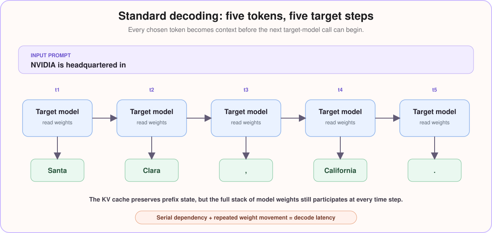
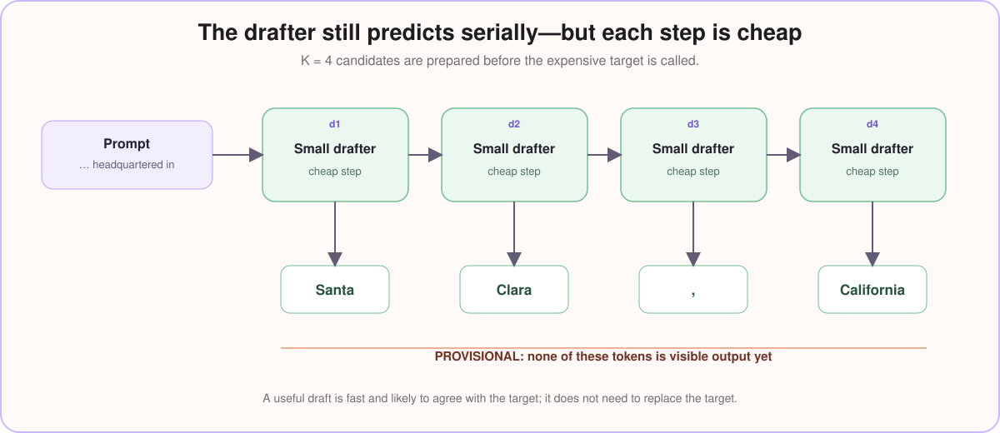
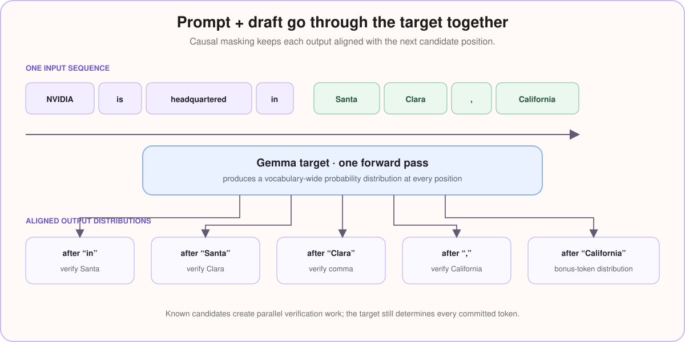
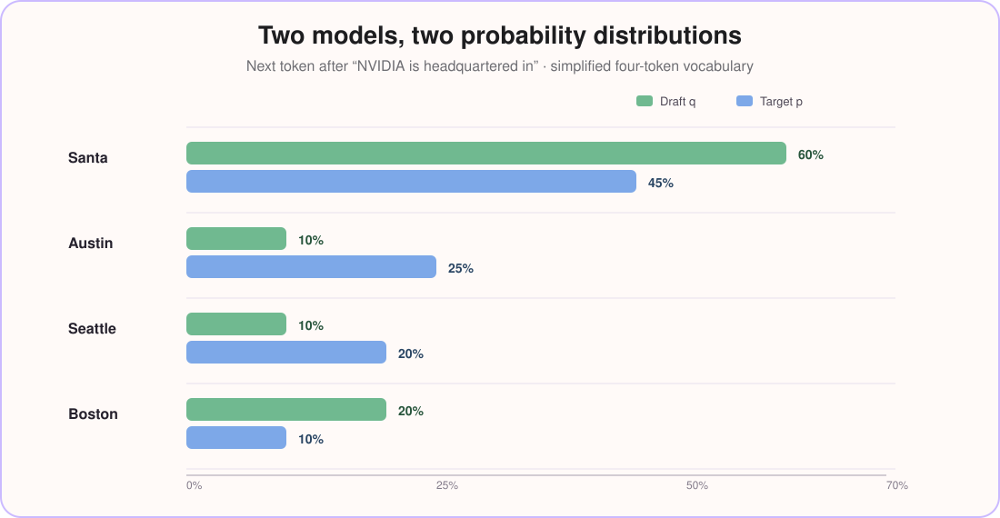
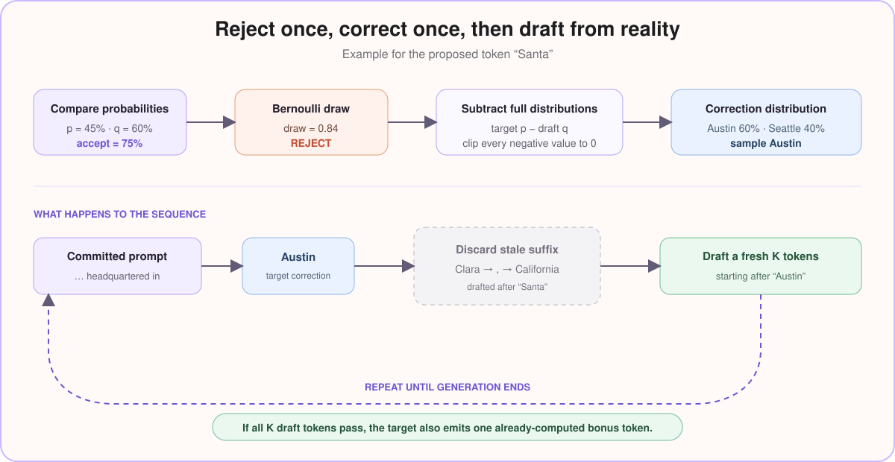
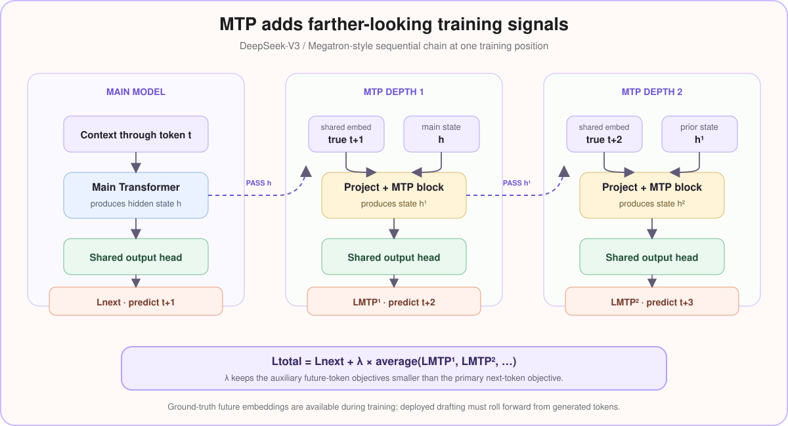
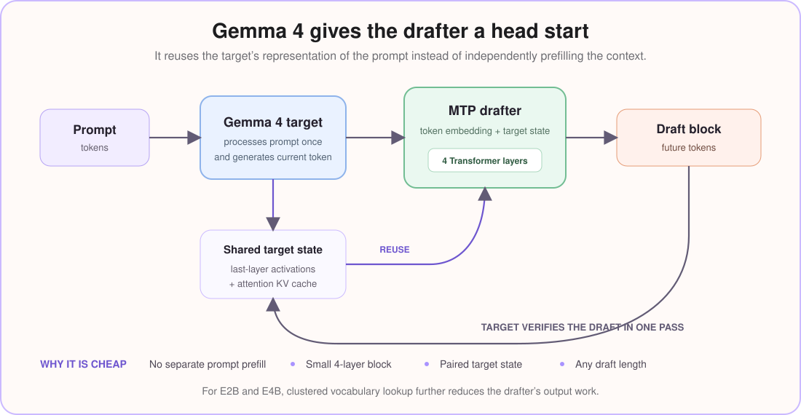

# Speculative Decoding: Draft Fast, Verify Once

> A small model proposes several tokens. A large model checks them together. The large model still decides what is emitted.

Language models appear to write continuously, but ordinary generation is a serial loop. The model produces one token, adds it to the context, and runs again for the next token. Even an obvious phrase pays for another full model step at every position.

**Speculative decoding reduces those expensive steps without handing control to a weaker model.** A fast draft model proposes a short continuation. The target model evaluates that entire proposal in one pass, accepts what fits its own distribution, and corrects the first disagreement.

This article builds that process one token at a time, then shows how Multi-Token Prediction (MTP) and Gemma 4 provide a purpose-built drafter.

!!! note "Scope of the performance claim"
    Correct speculative sampling preserves the target model’s output distribution. It does not guarantee the same text for two separately seeded runs. Google reports **up to 3× higher decoding throughput** for Gemma 4 MTP drafters across tested runtimes and hardware; the actual gain depends on acceptance rate, batch size, model architecture, memory placement, and workload.

## What is speculative decoding?

Speculative decoding is a **draft-and-verify** method for accelerating language-model generation.

It uses two components:

| Component | Job | Authority |
|---|---|---|
| Draft model | Quickly proposes the next **K tokens** | Its output is provisional |
| Target model | Scores the proposal and accepts or corrects it | Its distribution defines the final output |

Think of a junior writer and a senior editor. The junior types ahead because most continuations are predictable. The editor reviews a short block at once. If the block is good, several words move forward together. If one word fails review, the editor replaces it and the junior resumes from the corrected sentence.

The draft model makes speculation useful. The verification rule makes it safe.

## Why normal decoding becomes memory-bound

A large language model stores billions of learned weights. During generation, the accelerator repeatedly reads those weights from high-bandwidth memory into its compute units. For a single request, producing one token often does not create enough arithmetic work to fully occupy the hardware before the weights must be read again for the next token.

That makes decoding **memory-bandwidth bound**: speed is constrained more by moving weights than by multiplying numbers.

The important distinction is between prompt processing and token generation:

- During **prompt processing**, many known prompt tokens can be processed together, creating a large amount of parallel work.
- During **decoding**, the next token is unknown until the current token has been chosen, so a normal loop advances one position at a time.

### A five-step ordinary decode

Take the prompt:

```text
NVIDIA is headquartered in
```

Suppose the model generates five tokens that render as `Santa Clara, California.`. The exact tokenizer may split the text differently; these five pieces are illustrative.



At **t1**, the target reads the prompt and chooses `Santa`. At **t2**, it reads the cached prompt state plus `Santa` and chooses `Clara`. The process repeats for the comma, `California`, and the period.

The attention KV cache avoids recomputing the whole prefix, but the model’s layer weights still participate in every decode step. The visible sentence is short; the expensive target was consulted **five times**.

## A draft model can prepare the same continuation cheaply

Now place a much smaller model in front of the target. Starting from the same prompt, it generates a block of **K = 4** candidate tokens:

```text
Draft:  Santa → Clara → , → California
```

The drafter is still autoregressive. It proposes `Santa`, uses that proposal to predict `Clara`, and continues token by token. This is worthwhile only because each draft step is much cheaper than a target-model step.

Nothing has been committed yet. The candidate block is closer to autocomplete text than final output.



The best drafter is not necessarily the smartest small model in isolation. It must be fast, use a compatible vocabulary, and agree with the target often enough to repay its own overhead.

## Prompt and draft enter the target in one verification pass

The runtime concatenates the prompt and proposed block:

```text
[NVIDIA] [is] [headquartered] [in] [Santa] [Clara] [,] [California]
```

The target receives that complete known sequence in one forward pass. Because causal attention prevents a position from looking into its future, the target produces a valid next-token distribution at every boundary:

- logits after `in` score the drafted `Santa`;
- logits after `Santa` score `Clara`;
- logits after `Clara` score `,`;
- logits after `,` score `California`;
- logits after `California` are already available for a possible bonus token.



This does not make dependent token generation magically parallel. The drafter already supplied the dependencies. The target is performing **parallel verification of a known block**.

## The draft and target create two distributions

At every drafted position, both models provide probabilities over the vocabulary:

- the draft distribution, called **q**;
- the target distribution, called **p**.

For the first position after `NVIDIA is headquartered in`, imagine this simplified slice:

| Candidate token | Draft probability q | Target probability p |
|---|---:|---:|
| `Santa` | **60%** | **45%** |
| `Austin` | **10%** | **25%** |
| `Seattle` | **10%** | **20%** |
| `Boston` | **20%** | **10%** |



The drafter sampled `Santa` from q. The target also considers `Santa` plausible, but only with **45%** probability rather than the drafter’s **60%**. Always accepting it would allow the drafter to overproduce `Santa`.

## A Bernoulli draw decides whether the proposal survives

The two probabilities for the proposed token are not multiplied together. They form an **acceptance ratio**:

```text
acceptance probability = min(1, target probability ÷ draft probability)
```

For `Santa`:

```text
min(1, 0.45 ÷ 0.60) = 0.75
```

The verifier then performs a Bernoulli trial—a yes/no random draw with a **75% chance of yes**. An equivalent implementation samples a uniform number between 0 and 1:

```text
random draw = 0.62  →  0.62 < 0.75  →  accept
random draw = 0.84  →  0.84 > 0.75  →  reject
```

Why introduce randomness? Across many comparable generations, the drafter proposes `Santa` 60 times per 100, while the target wants it 45 times. Accepting **75% of 60 proposals gives 45 accepted proposals**. The ratio is probability bookkeeping, not a confidence threshold.

If p is at least q, the ratio is capped at 1 and the token is always accepted. The drafter has not overallocated probability to it.

Verification proceeds from left to right. Once one token is rejected, later drafted tokens are no longer valid because they were conditioned on a path the target did not commit.

## Rejection recovers probability that the draft underrepresented

Suppose the Bernoulli draw rejects `Santa`. The verifier must produce a replacement that preserves the target distribution. Sampling directly from p would double-count probability already handled by the acceptance step.

Instead, compare the **full distributions**, not only the selected token:

1. Subtract the draft probability from the target probability for every token.
2. Cap negative values at zero.
3. Normalize the positive values so they sum to 100%.
4. Sample the replacement from that correction distribution.

Using the earlier numbers:

| Token | p − q | After capping at zero | Normalized correction |
|---|---:|---:|---:|
| `Santa` | 45% − 60% = −15% | **0%** | **0%** |
| `Austin` | 25% − 10% = 15% | **15%** | **60%** |
| `Seattle` | 20% − 10% = 10% | **10%** | **40%** |
| `Boston` | 10% − 20% = −10% | **0%** | **0%** |

The remaining positive mass is 25 points. After normalization, the correction draw chooses `Austin` with **60%** probability or `Seattle` with **40%** probability.

Notice that rejected `Santa` receives zero correction probability. Its draft probability was already too high; immediately sampling it again would undo the correction.



If the correction draw selects `Austin`, the committed context becomes:

```text
NVIDIA is headquartered in Austin
```

The remaining draft `Clara → , → California` was created under `… in Santa`, so it is discarded. The drafter receives the corrected prefix and proposes a fresh set of K future tokens. This accept-or-correct cycle repeats until generation ends.

Keeping only q’s probability for the selected token is sufficient for the acceptance ratio, but insufficient for correction. Exact speculative sampling needs q’s **full vocabulary distribution at each drafted position**.

## A fully accepted draft earns a bonus token

Suppose all four drafted tokens are accepted:

```text
Santa → Clara → , → California
```

During the same target pass, the logits after `California` were also computed. The target can sample the next token—perhaps `.`—without another target invocation:

```text
4 accepted draft tokens + 1 target bonus token = 5 committed tokens
```

The bonus is not another draft guess. It comes directly from the target distribution. This is the best case: one target verification pass advances the sequence by **K + 1 tokens**.

If a proposal is rejected earlier, the correction token still advances generation by one position, so the target pass is not completely wasted. The overall speedup depends on how many draft tokens survive before that first rejection.

## MTP makes the draft model better at looking ahead

Multi-Token Prediction changes what a model learns during training. Ordinary next-token training asks, “What comes immediately next?” MTP adds objectives that reach farther into the future.

Different systems implement this family of ideas differently. The original MTP work studied future-token prediction heads. DeepSeek-V3 uses a chain of small MTP modules: each stage builds on the previous hidden state and predicts one position farther ahead. The additional losses are kept smaller than the main next-token loss, so future prediction guides rather than overwhelms normal language modeling.

The DeepSeek-V3/Megatron-style chain makes the training signal concrete. At a given position, the main model predicts token **t+1** as usual. The first MTP module combines the main hidden state with the ground-truth embedding for **t+1** and learns to predict **t+2**. The second module consumes the first module’s state plus the ground-truth embedding for **t+2**, then learns to predict **t+3**. This use of known training tokens is teacher forcing: the correct future text is available while learning, even though it will not be available during live generation.



Each path produces a cross-entropy loss. The future losses are averaged, scaled by a small weight, and added to the ordinary next-token loss:

```text
total loss = next-token loss + λ × average(MTP loss 1, MTP loss 2, …)
```

The weight **λ** prevents the auxiliary look-ahead tasks from overpowering the model’s primary job. NVIDIA Megatron-LM uses **0.1 as the default scaling factor** for this DeepSeek-style configuration; it is a training choice, not a universal MTP constant.

At inference time, that future-looking path can become a drafter:

```text
MTP training → better short-horizon proposals → higher acceptance
             → more tokens per target pass → lower decode latency
```

MTP and speculative decoding are related but not interchangeable. **MTP creates proposals; speculative decoding verifies them.** A speculative decoder can use another type of drafter, and an MTP-trained model can still run with ordinary one-token decoding.

## Gemma 4 ships purpose-built MTP draft models

Google released MTP drafters for Gemma 4’s **E2B, E4B, 31B, and 26B-A4B models on April 16, 2026**. The later **12B Unified** model also has a paired drafter. Instruction-tuned drafter checkpoints use an `-assistant` suffix—for example:

```text
Target:  google/gemma-4-31B-it
Drafter: google/gemma-4-31B-it-assistant
```

“Assistant” here means an assistant model for speculative decoding, not a standalone chatbot.

| Gemma 4 target | Target scale | Purpose-built drafter |
|---|---:|---:|
| E2B | **2.3B effective parameters** | **76M parameters** |
| E4B | **4.5B effective parameters** | **77M parameters** |
| 12B Unified | **12B parameters** | **400M parameters** |
| 26B-A4B MoE | **26B total / 3.8B active** | **430M parameters** |
| 31B Dense | **31B parameters** | **500M parameters** |

Gemma 4’s drafter is small but tightly paired with its target. It uses the target’s last-layer activations, token embeddings, and cached attention keys and values. That shared state removes the need for the drafter to process the complete prompt independently.



The drafter contains a **four-layer Transformer**—three local-attention layers and one global-attention layer. Google reports hidden dimensions of **256 for E2B and E4B** and **1,024 for 26B-A4B and 31B**. For E2B and E4B, clustered vocabulary lookup reduces the expensive final projection from **262,000 vocabulary entries to 4,096 candidates**.

The paired drafter can accelerate many kinds of Gemma output: chat, code, JSON, reasoning traces, and text responses to multimodal prompts, provided the serving runtime supports the architecture. It is not a universal draft model for unrelated targets. Use the drafter matching the exact Gemma 4 target and tuning variant.

In Hugging Face Transformers, the connection is exposed directly through `assistant_model`:

```python
outputs = target_model.generate(
    **inputs,
    assistant_model=assistant_model,
    max_new_tokens=256,
)
```

Google reports **up to 3× higher tokens per second** across LiteRT-LM, MLX, Transformers, and vLLM testing. Treat that as a measured upper bound. Dense models can verify several positions while reusing the same weights. Gemma 4’s 26B-A4B Mixture-of-Experts target may load different experts for different drafted tokens, which can reduce the gain at batch size 1. Google reports better expert reuse at batches of **4 to 8**, including up to roughly **2.2×** locally on Apple Silicon.

The production question is therefore not “Does MTP work?” but “How often does this drafter agree on our prompts, and what does that agreement save on our hardware?” Measure decode tokens per second, end-to-end latency, accepted tokens per verification pass, memory use, and results by workload.

## The complete mental model

Normal decoding asks the target to move one token at a time. Speculative decoding lets a cheap model sketch several steps, then gives the target one structured review:

```text
prompt
  → draft K candidates
  → target produces K verification distributions in one pass
  → accept each candidate using target-versus-draft probability
  → on rejection, sample from positive(target − draft)
  → discard the stale suffix and draft again from the correction
  → if all K pass, add one target bonus token
```

The target remains the author. The draft model only arrives with a useful first draft.

## References

- Leviathan, Kalman, and Matias, [Fast Inference from Transformers via Speculative Decoding](https://arxiv.org/abs/2211.17192)
- Chen et al., [Accelerating Large Language Model Decoding with Speculative Sampling](https://arxiv.org/abs/2302.01318)
- Gloeckle et al., [Better & Faster Large Language Models via Multi-token Prediction](https://arxiv.org/abs/2404.19737)
- DeepSeek-AI, [DeepSeek-V3 Technical Report](https://arxiv.org/abs/2412.19437)
- Google DeepMind, [Gemma 4 Technical Report](https://arxiv.org/abs/2607.02770)
- Google AI for Developers, [Speed up Gemma 4 with Multi-Token Prediction](https://ai.google.dev/gemma/docs/mtp/overview)
- Google, [Multi-token prediction in Gemma 4](https://blog.google/innovation-and-ai/technology/developers-tools/multi-token-prediction-gemma-4/)
- Google AI for Developers, [Gemma release history](https://ai.google.dev/gemma/docs/releases)
- Google, [Gemma 4 26B-A4B instruction-tuned drafter model card](https://huggingface.co/google/gemma-4-26B-A4B-it-assistant)
- Gala, [Speculative Decoding: From Theory to Implementation](https://galacodes.hashnode.dev/speculative-decoding), a code-oriented companion; its published correction snippet subtracts the target distribution from itself, so use the original papers’ target-minus-draft correction
